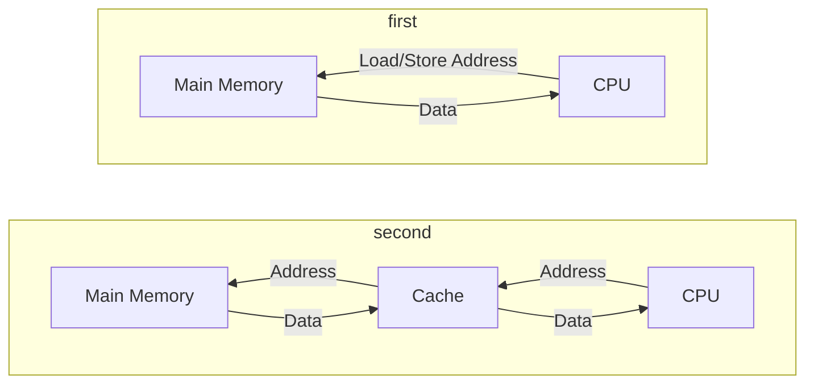

---
{"dg-publish":true,"permalink":"/leeds-university/computer-science/compulsory-modules/computer-architecture/section-10-cache-memory/section-10-cache-memory/"}
---

>[!Textbook Reference]
> [Stallings](https://leeds.primo.exlibrisgroup.com/permalink/44LEE_INST/13rlbcs/alma991012536539705181) - 4

#### Caches occupy most of a chip

^[An example of a chip]
### Cache and Main Memory

#TODO 

### Memory Blocks and Cache Lines

$\color{lightblue}\textrm{Block}$: The unit of data transfer
- We break main memory into blocks
	- Each block holds $m$ bytes ( typically, 64 bytes )
$\color{lightblue}\textrm{Line}$: We break the cache into multiple lines
- Each cache line holds exactly one memory $\color{lightblue}\textrm{block}$
#### Terminology
- A memory access is said to $\color{red}\textrm{hit}$ at a cache if the block is found at a cache line
- Access time of a hit is the $\color{red}\textrm{hit time}$
- The additional time ( much slower ) to fetch a block on a miss is called the $\color{red}\textrm{miss penalty}$
$\textcolor{red}{Miss\ Rate} = Misses\ / \ Accesses$
