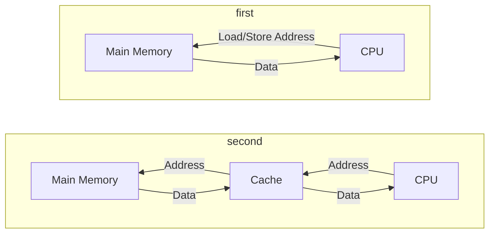
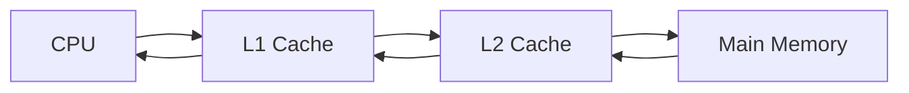

---
{"dg-publish":true,"permalink":"/leeds-university/computer-science/compulsory-modules/computer-architecture/section-10-cache-memory/section-10-cache-memory/"}
---

>[!Textbook Reference]
> [Stallings](https://leeds.primo.exlibrisgroup.com/permalink/44LEE_INST/13rlbcs/alma991012536539705181) - 4

#### Caches occupy most of a chip

^[An example of a chip]
### Cache and Main Memory

### Memory Address Size
- If we have $\color{lightblue} n$ bits, we can represent $\color{lightblue} 2^{n}$ unique memory addresses
  ( **unsigned numbers starting from 0** )
### Memory Blocks and Cache Lines

$\color{lightblue}\text{Block}$: The unit of data transfer
- We break main memory into blocks
	- Each block holds $m$ bytes ( typically, 64 bytes )
$\color{lightblue}\text{Line}$: We break the cache into multiple lines
- Each cache line holds exactly one memory $\color{lightblue}\text{block}$
#### Terminology
- A memory access is said to $\color{red}\text{Hit}$ at a cache if the block is found at a cache line
- [[Leeds University/Computer Science/Compulsory Modules/Computer Architecture/Section 9 - Memory/Definitions/Access Time\|Access time]] of a hit is the $\color{red}\text{Hit Time}$
- The additional time ( much slower ) to fetch a block on a miss is called the $\color{red}\text{Miss Penalty}$
$\textcolor{red}{Miss\ Rate} = Misses\ / \ Accesses$

<a class="markdown-embed-link" href="/leeds-university/computer-science/compulsory-modules/computer-architecture/section-10-cache-memory/average-memory-access-time/#equation" aria-label="Open link"><svg xmlns="http://www.w3.org/2000/svg" width="24" height="24" viewBox="0 0 24 24" fill="none" stroke="currentColor" stroke-width="2" stroke-linecap="round" stroke-linejoin="round" class="svg-icon lucide-link"><path d="M10 13a5 5 0 0 0 7.54.54l3-3a5 5 0 0 0-7.07-7.07l-1.72 1.71"></path><path d="M14 11a5 5 0 0 0-7.54-.54l-3 3a5 5 0 0 0 7.07 7.07l1.71-1.71"></path></svg></a>

$

# AMAT

$
\text{AMAT} = \text{Hit Time}\ +\ (\ \text{Miss Rate}\ \times\ \text{Miss Penalty}\ )
$ 

##### Improving AMAT
- Keep *Miss Rate* low
	- Increased cache size lowers cache *Miss Rate*, but this increases *Hit Time*
	- **Better cache management policies:**
		- Prefetching: Anticipate what you will need
		- Replacement: Anticipate what you don't need
- Keep *Miss Penalty* low
	- Reduce miss penalty with a faster main memory ( but higher cost )
	- Better solved by adding intermediate levels

### Cache Hierarchies 
Trade-off between [[Leeds University/Computer Science/Compulsory Modules/Computer Architecture/Section 9 - Memory/Definitions/Access Time\|access time]] & hit rate
	- L1 Cache can focus on a fast access ( hit ) time
	- L2 Cache can focus on a good hit rate

<a class="markdown-embed-link" href="/leeds-university/computer-science/compulsory-modules/computer-architecture/section-10-cache-memory/direct-mapped-cache/direct-mapped-cache/#direct-mapped-cache" aria-label="Open link"><svg xmlns="http://www.w3.org/2000/svg" width="24" height="24" viewBox="0 0 24 24" fill="none" stroke="currentColor" stroke-width="2" stroke-linecap="round" stroke-linejoin="round" class="svg-icon lucide-link"><path d="M10 13a5 5 0 0 0 7.54.54l3-3a5 5 0 0 0-7.07-7.07l-1.72 1.71"></path><path d="M14 11a5 5 0 0 0-7.54-.54l-3 3a5 5 0 0 0 7.07 7.07l1.71-1.71"></path></svg></a>

##### Direct Mapped Cache
In **Direct-Mapped Caches** each memory block is assigned to a specific line in the cache
- This makes block placement, lookup and replacement much easier
- Usually used in embedded systems
###### Disadvantages
- While DMC is simple and cheap, it has large problems with its  	- If the program attempts to access multiple addresses ( or [[Leeds University/Computer Science/Compulsory Modules/Computer Architecture/Section 10 - Cache Memory/Direct Mapped Cache/DMC - Spatial Locality\|blocks]] ) assigned to the same cache line repeatedly, there will be constant 'cache misses'
	- This is known as ***thrashing***

- V = [[Leeds University/Computer Science/Compulsory Modules/Computer Architecture/Section 10 - Cache Memory/Direct Mapped Cache/Direct Mapped Cache#Valid Bit\|Valid Bit]]
- D = [[Leeds University/Computer Science/Compulsory Modules/Computer Architecture/Section 10 - Cache Memory/Cache Block Replacement Policies#Write-Back Caches\|Dirty Bit]]
