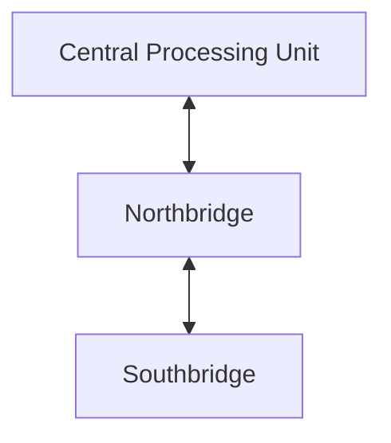

---
{"dg-publish":true,"permalink":"/leeds-university/computer-science/compulsory-modules/computer-architecture/section-17-the-system-bus/section-17-the-system-bus/"}
---

1. 
2. CPU puts *“Keyboard: did the user type anything?”*
3. w
4. 4
5. The keyboard then writes *“CPU: Yes, user type **A**”*
6. At some point the CPU reads the bus and…

---
Each bus consists of multiple **lines**, each line can transmit a single bit
e.g., A 32-bit wide bus has 32 single-bit lines

The system bus connects major components
	- It typically consists of 50–100s of separate lines
	- [[Leeds University/Computer Science/Compulsory Modules/Computer Architecture/Section 17 - The System Bus/Data Lines\|Data lines]]
	- [[Leeds University/Computer Science/Compulsory Modules/Computer Architecture/Section 17 - The System Bus/Address Lines\|Address lines]]
	- [[Leeds University/Computer Science/Compulsory Modules/Computer Architecture/Section 17 - The System Bus/Control Lines\|Control lines]]

Attaching many devices to a single bus leads to:
	- Long data paths and hence **slower communications** due to propagation delays
	- More **complicated communication** with the aggregate demand for bus access
Most systems use **multiple buses** to overcome these problems
	- In general, they are **hierarchical**

#### Bandwidth, Delay and Throughput
- **Bandwidth**: The amount of data that can be transferred at once (e.g. per clock cycle)
- **Clock Speed**:
	- 1 MHz = 1 Million cycles per second
	- 1 GHz = 1000 MHz
	- Faster clock speed = lower transmission [[Leeds University/Computer Science/Compulsory Modules/Computer Architecture/Section 9 - Memory/Definitions/Access Time\|latency]]
##### Pentium 4 Bus Architecture

**Northbridge**: Connects to ‘fast’ devices (e.g. [[Leeds University/Computer Science/Compulsory Modules/Computer Architecture/Section 9 - Memory/Definitions/RAM\|RAM]])
**Southbridge**: Connects to ‘slow’ devices (e.g. SATA, USB)
###### Bus Arbitration
Different modules may want to use the bus at the same time!
**Centralised Arbitration**: A single hardware device acts as the arbiter for the bus (often part of the CPU)
**Distributed Arbitration**: Each module can gain control of the bus. No separate arbiter but more control logic is required on *all* modules
###### Bus Timing
Timing (or clocking) refers to the coordination of events on the bus:
- With **synchronous timing** the occurrence of events
#TODO never mind the cunt got rid of it
