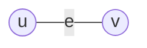
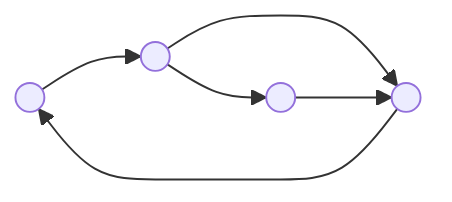

---
{"dg-publish":true,"permalink":"/leeds-university/computer-science/compulsory-modules/discrete-mathematics/3-graph-theory/3-graph-theory/"}
---

###### [[Leeds University/Computer Science/Compulsory Modules/Discrete Mathematics/3. Graph Theory/3.2 Graph Models\|3.2]]

<a class="markdown-embed-link" href="/leeds-university/computer-science/compulsory-modules/discrete-mathematics/3-graph-theory/3-2-graph-models/#graph-models" aria-label="Open link"><svg xmlns="http://www.w3.org/2000/svg" width="24" height="24" viewBox="0 0 24 24" fill="none" stroke="currentColor" stroke-width="2" stroke-linecap="round" stroke-linejoin="round" class="svg-icon lucide-link"><path d="M10 13a5 5 0 0 0 7.54.54l3-3a5 5 0 0 0-7.07-7.07l-1.72 1.71"></path><path d="M14 11a5 5 0 0 0-7.54-.54l-3 3a5 5 0 0 0 7.07 7.07l1.71-1.71"></path></svg></a>

###### Graph Models
A *[[Leeds University/Computer Science/Compulsory Modules/Discrete Mathematics/3. Graph Theory/Definitions/Simple Graph\|Simple Graph]]* $G=({\color{mauve} V}(G),{\color{orange} E}(G))$ with $p$ vertices and $q$ edges consists of a *vertex set* (or a *node set*) ${\color{mauve} V}(G)=\set{v_{1},\dots,v_{p}}$ and an *edge set* ${\color{orange} E}(G)=\set{{\color{yellow} e}_{1},\dots,{\color{yellow} e}_{q}}$ where each edge is an unordered pair of vertices

An edge ${\color{yellow} e}={u,v}$ is also denoted by $uv$ or $vu$

The vertices contained in an edge ${\color{yellow} e}$ are its *endpoints* (or *endnodes* or *endvertices*), and ${\color{yellow} e}$ is said to *connect* $u$ and $v$. An edge ${\color{yellow} e}=uv$ is said to be *incident* to its endpoints $u$ and $v$. Two vertices that are endpoints of the same edge are said to be *adjacent vertices*, and two edges that are incident to the same vertex are said to be *adjacent edges*. Two adjacent vertices are also called *neighbouring vertices*.

<a class="markdown-embed-link" href="/leeds-university/computer-science/compulsory-modules/discrete-mathematics/3-graph-theory/3-2-graph-models/#types-of-graphs" aria-label="Open link"><svg xmlns="http://www.w3.org/2000/svg" width="24" height="24" viewBox="0 0 24 24" fill="none" stroke="currentColor" stroke-width="2" stroke-linecap="round" stroke-linejoin="round" class="svg-icon lucide-link"><path d="M10 13a5 5 0 0 0 7.54.54l3-3a5 5 0 0 0-7.07-7.07l-1.72 1.71"></path><path d="M14 11a5 5 0 0 0-7.54-.54l-3 3a5 5 0 0 0 7.07 7.07l1.71-1.71"></path></svg></a>

###### Types of Graphs

<a class="markdown-embed-link" href="/leeds-university/computer-science/compulsory-modules/discrete-mathematics/3-graph-theory/definitions/simple-graph/" aria-label="Open link"><svg xmlns="http://www.w3.org/2000/svg" width="24" height="24" viewBox="0 0 24 24" fill="none" stroke="currentColor" stroke-width="2" stroke-linecap="round" stroke-linejoin="round" class="svg-icon lucide-link"><path d="M10 13a5 5 0 0 0 7.54.54l3-3a5 5 0 0 0-7.07-7.07l-1.72 1.71"></path><path d="M14 11a5 5 0 0 0-7.54-.54l-3 3a5 5 0 0 0 7.07 7.07l1.71-1.71"></path></svg></a>

*Simple Graphs* are unweighted and undirected. They also contain **no** [[Leeds University/Computer Science/Compulsory Modules/Discrete Mathematics/3. Graph Theory/Definitions/Loop\|loops]] or [[Leeds University/Computer Science/Compulsory Modules/Discrete Mathematics/3. Graph Theory/Definitions/Parallel Edge\|parallel edges]]

<a class="markdown-embed-link" href="/leeds-university/computer-science/compulsory-modules/discrete-mathematics/3-graph-theory/definitions/multigraph/" aria-label="Open link"><svg xmlns="http://www.w3.org/2000/svg" width="24" height="24" viewBox="0 0 24 24" fill="none" stroke="currentColor" stroke-width="2" stroke-linecap="round" stroke-linejoin="round" class="svg-icon lucide-link"><path d="M10 13a5 5 0 0 0 7.54.54l3-3a5 5 0 0 0-7.07-7.07l-1.72 1.71"></path><path d="M14 11a5 5 0 0 0-7.54-.54l-3 3a5 5 0 0 0 7.07 7.07l1.71-1.71"></path></svg></a>

*Multigraphs* (or *graphs* or *undirected graphs*) allow [[Leeds University/Computer Science/Compulsory Modules/Discrete Mathematics/3. Graph Theory/Definitions/Loop\|loops]] and [[Leeds University/Computer Science/Compulsory Modules/Discrete Mathematics/3. Graph Theory/Definitions/Parallel Edge\|parallel edges]]

<a class="markdown-embed-link" href="/leeds-university/computer-science/compulsory-modules/discrete-mathematics/3-graph-theory/definitions/directed-graph/" aria-label="Open link"><svg xmlns="http://www.w3.org/2000/svg" width="24" height="24" viewBox="0 0 24 24" fill="none" stroke="currentColor" stroke-width="2" stroke-linecap="round" stroke-linejoin="round" class="svg-icon lucide-link"><path d="M10 13a5 5 0 0 0 7.54.54l3-3a5 5 0 0 0-7.07-7.07l-1.72 1.71"></path><path d="M14 11a5 5 0 0 0-7.54-.54l-3 3a5 5 0 0 0 7.07 7.07l1.71-1.71"></path></svg></a>

*Directed graphs* (or *digraphs*) ***ordered*** edges, which are called *directed edges* or *arcs*

<a class="markdown-embed-link" href="/leeds-university/computer-science/compulsory-modules/discrete-mathematics/3-graph-theory/definitions/weighted-graph/" aria-label="Open link"><svg xmlns="http://www.w3.org/2000/svg" width="24" height="24" viewBox="0 0 24 24" fill="none" stroke="currentColor" stroke-width="2" stroke-linecap="round" stroke-linejoin="round" class="svg-icon lucide-link"><path d="M10 13a5 5 0 0 0 7.54.54l3-3a5 5 0 0 0-7.07-7.07l-1.72 1.71"></path><path d="M14 11a5 5 0 0 0-7.54-.54l-3 3a5 5 0 0 0 7.07 7.07l1.71-1.71"></path></svg></a>

*Weighted Graphs*: Each edge ${\color{yellow} e}$ is assigned a weight $w({\color{yellow} e})$

You can also have different combinations of the above models, such as directed weighted graphs, or weighted simple graphs

###### [[Leeds University/Computer Science/Compulsory Modules/Discrete Mathematics/3. Graph Theory/3.3 Isomorphic Graphs\|3.3]]

<a class="markdown-embed-link" href="/leeds-university/computer-science/compulsory-modules/discrete-mathematics/3-graph-theory/3-3-isomorphic-graphs/#isomorphic-graphs" aria-label="Open link"><svg xmlns="http://www.w3.org/2000/svg" width="24" height="24" viewBox="0 0 24 24" fill="none" stroke="currentColor" stroke-width="2" stroke-linecap="round" stroke-linejoin="round" class="svg-icon lucide-link"><path d="M10 13a5 5 0 0 0 7.54.54l3-3a5 5 0 0 0-7.07-7.07l-1.72 1.71"></path><path d="M14 11a5 5 0 0 0-7.54-.54l-3 3a5 5 0 0 0 7.07 7.07l1.71-1.71"></path></svg></a>

###### Isomorphic Graphs

Graphs $G$ and $H$ look exactly the same with exception that their vertices and edges have different labels. $G$ and $H$ are not identical, but isomorphic.

Let $G$ and $H$ be simple graphs.
$G$ is *isomorphic* to $H$, denoted by $G\cong H$, if there exists a [[Leeds University/Computer Science/Compulsory Modules/Fundamental Math Concepts/5. Set Theory/Definitions/Definition 5.30 (Bijective)\|bijection]] $f : {\color{mauve} V}(G)\rightarrow {\color{mauve} V}(H)$ such that $uv\in E(G )$ [[Leeds University/Computer Science/Compulsory Modules/Fundamental Math Concepts/Fundamentals of Logic/Propositional Logic/Connectives/Biconditional\|if and only if]] $f(u)f(v)\in E(H)$

**Graph Isomorphism Problem**: Determine in polynomial time whether two graphs are isomorphic. (This is a very difficult problem that is still unsolved)

An unlabelled graph can be though of as a representative of an equivalence class of isomorphic graphs. We assign label to vertices and edges in a graph for the purpose of referring to them.

###### [[Leeds University/Computer Science/Compulsory Modules/Discrete Mathematics/3. Graph Theory/3.4 Vertex Degree\|3.4]]

<a class="markdown-embed-link" href="/leeds-university/computer-science/compulsory-modules/discrete-mathematics/3-graph-theory/3-4-vertex-degree/#vertex-degree" aria-label="Open link"><svg xmlns="http://www.w3.org/2000/svg" width="24" height="24" viewBox="0 0 24 24" fill="none" stroke="currentColor" stroke-width="2" stroke-linecap="round" stroke-linejoin="round" class="svg-icon lucide-link"><path d="M10 13a5 5 0 0 0 7.54.54l3-3a5 5 0 0 0-7.07-7.07l-1.72 1.71"></path><path d="M14 11a5 5 0 0 0-7.54-.54l-3 3a5 5 0 0 0 7.07 7.07l1.71-1.71"></path></svg></a>

###### Vertex Degree
The *degree of a vertex $v$* in the graph $G$, denoted by $d_{G}(v)$ or just $d(v)$ (or sometimes $\deg(v)$, as in the book), is the number of edges that are incident to $v$ (with [[Leeds University/Computer Science/Compulsory Modules/Discrete Mathematics/3. Graph Theory/Definitions/Loop\|loops]] counted twice, i.e. each [[Leeds University/Computer Science/Compulsory Modules/Discrete Mathematics/3. Graph Theory/Definitions/Loop\|loop]] on $v$ contributes 2 to $d(v)$)

**[[Leeds University/Computer Science/Compulsory Modules/Discrete Mathematics/3. Graph Theory/Theorems/Theorem 3.1\|Theorem 3.1]] Degree-sum Formula**

<a class="markdown-embed-link" href="/leeds-university/computer-science/compulsory-modules/discrete-mathematics/3-graph-theory/theorems/theorem-3-1/#def" aria-label="Open link"><svg xmlns="http://www.w3.org/2000/svg" width="24" height="24" viewBox="0 0 24 24" fill="none" stroke="currentColor" stroke-width="2" stroke-linecap="round" stroke-linejoin="round" class="svg-icon lucide-link"><path d="M10 13a5 5 0 0 0 7.54.54l3-3a5 5 0 0 0-7.07-7.07l-1.72 1.71"></path><path d="M14 11a5 5 0 0 0-7.54-.54l-3 3a5 5 0 0 0 7.07 7.07l1.71-1.71"></path></svg></a>

If $G$ is a graph with vertices $v_{1},v_{2},\dots,v_{n}$, then $\sum\limits^{n}_{i=1} d(v_{i})=2|{\color{orange} E}(G)|$ 
###### *Proof*
Each loop contributes 2 to the summation. In the summation, each edge ${\color{yellow} e}=uv$ that is not a loop is counted exactly twice, once in $d(u)$ and once in $d(v)$

**[[Leeds University/Computer Science/Compulsory Modules/Discrete Mathematics/3. Graph Theory/Theorems/Corollary 3.1\|Corollary 3.1]]**

<a class="markdown-embed-link" href="/leeds-university/computer-science/compulsory-modules/discrete-mathematics/3-graph-theory/theorems/corollary-3-1/#def" aria-label="Open link"><svg xmlns="http://www.w3.org/2000/svg" width="24" height="24" viewBox="0 0 24 24" fill="none" stroke="currentColor" stroke-width="2" stroke-linecap="round" stroke-linejoin="round" class="svg-icon lucide-link"><path d="M10 13a5 5 0 0 0 7.54.54l3-3a5 5 0 0 0-7.07-7.07l-1.72 1.71"></path><path d="M14 11a5 5 0 0 0-7.54-.54l-3 3a5 5 0 0 0 7.07 7.07l1.71-1.71"></path></svg></a>

In any graph, the number of vertices of odd degree is even 
###### *Proof*
Let $x_{1}\dots,x_{n}$ be vertices of graph $G$ with even degree and let $y_{1},\dots,y_{m}$ be vertices of odd degree
Let ${\color{blue} S}=d(x_{1})+\dots+d(x_{n})$
and ${\color{red} T}=d(y_{1})+\dots+d(y_{m})$
By [[Leeds University/Computer Science/Compulsory Modules/Discrete Mathematics/3. Graph Theory/Theorems/Theorem 3.1\|Theorem 3.1]], ${\color{blue} S}+{\color{red} T}$ is even
Since ${\color{blue} S}$ is the sum of even numbers, ${\color{blue} S}$ is even
So ${\color{red} T}$ must be even
Since ${\color{red} T}$ is the sum of $m$ odd numbers, $m$ must be even

###### [[Leeds University/Computer Science/Compulsory Modules/Discrete Mathematics/3. Graph Theory/3.5 Paths and Cycles\|3.5]]

<a class="markdown-embed-link" href="/leeds-university/computer-science/compulsory-modules/discrete-mathematics/3-graph-theory/3-5-paths-and-cycles/#paths-and-cycles" aria-label="Open link"><svg xmlns="http://www.w3.org/2000/svg" width="24" height="24" viewBox="0 0 24 24" fill="none" stroke="currentColor" stroke-width="2" stroke-linecap="round" stroke-linejoin="round" class="svg-icon lucide-link"><path d="M10 13a5 5 0 0 0 7.54.54l3-3a5 5 0 0 0-7.07-7.07l-1.72 1.71"></path><path d="M14 11a5 5 0 0 0-7.54-.54l-3 3a5 5 0 0 0 7.07 7.07l1.71-1.71"></path></svg></a>

###### Paths and Cycles

<a class="markdown-embed-link" href="/leeds-university/computer-science/compulsory-modules/discrete-mathematics/3-graph-theory/definitions/path/" aria-label="Open link"><svg xmlns="http://www.w3.org/2000/svg" width="24" height="24" viewBox="0 0 24 24" fill="none" stroke="currentColor" stroke-width="2" stroke-linecap="round" stroke-linejoin="round" class="svg-icon lucide-link"><path d="M10 13a5 5 0 0 0 7.54.54l3-3a5 5 0 0 0-7.07-7.07l-1.72 1.71"></path><path d="M14 11a5 5 0 0 0-7.54-.54l-3 3a5 5 0 0 0 7.07 7.07l1.71-1.71"></path></svg></a>

Let $v_{0}$ and $v_{n}$ be vertices in a graph $G$. A *path* in $G$ from $v_{0}$ to $v_{n}$ of *length* $n$ is an alternating sequence of $n+1$ vertices and $n$ edges, $v_{0}{\color{yellow} e}_{1}v_{1}{\color{yellow} e}_{2}\dots v_{n-1}{\color{yellow} e}_{n}v_{n}$, in which edge ${\color{yellow} e}_{i}$ is incident on vertices $v_{i-1}$ and $v_{i}$ for every $i=1,\dots,n$

Note that in a [[Leeds University/Computer Science/Compulsory Modules/Discrete Mathematics/3. Graph Theory/Definitions/Simple Graph\|simple graph]], to denote a path we just need to list the sequence of vertices since two vertices are connected by only one edge, e.g. $v_{0}v_{1}\dots v_{n}$

<a class="markdown-embed-link" href="/leeds-university/computer-science/compulsory-modules/discrete-mathematics/3-graph-theory/definitions/simple-path/" aria-label="Open link"><svg xmlns="http://www.w3.org/2000/svg" width="24" height="24" viewBox="0 0 24 24" fill="none" stroke="currentColor" stroke-width="2" stroke-linecap="round" stroke-linejoin="round" class="svg-icon lucide-link"><path d="M10 13a5 5 0 0 0 7.54.54l3-3a5 5 0 0 0-7.07-7.07l-1.72 1.71"></path><path d="M14 11a5 5 0 0 0-7.54-.54l-3 3a5 5 0 0 0 7.07 7.07l1.71-1.71"></path></svg></a>

A *simple path* from vertex $u$ to vertex $v$ in a graph $G$ is a path from $u$ to $v$ with no repeated vertices

**Lemma 3.1**

<a class="markdown-embed-link" href="/leeds-university/computer-science/compulsory-modules/discrete-mathematics/3-graph-theory/theorems/lemma-3-1/#def" aria-label="Open link"><svg xmlns="http://www.w3.org/2000/svg" width="24" height="24" viewBox="0 0 24 24" fill="none" stroke="currentColor" stroke-width="2" stroke-linecap="round" stroke-linejoin="round" class="svg-icon lucide-link"><path d="M10 13a5 5 0 0 0 7.54.54l3-3a5 5 0 0 0-7.07-7.07l-1.72 1.71"></path><path d="M14 11a5 5 0 0 0-7.54-.54l-3 3a5 5 0 0 0 7.07 7.07l1.71-1.71"></path></svg></a>

Let $G$ be a graph, and $u$ and $v$ two vertices of $G$. There is a [[Leeds University/Computer Science/Compulsory Modules/Discrete Mathematics/3. Graph Theory/Definitions/Path\|path]] from $u$ to $v$ in $G$ [[Leeds University/Computer Science/Compulsory Modules/Fundamental Math Concepts/Fundamentals of Logic/Propositional Logic/Connectives/Biconditional\|if and only if]] there is a [[Leeds University/Computer Science/Compulsory Modules/Discrete Mathematics/3. Graph Theory/Definitions/Simple Path\|simple path]] from $u$ to $v$ in $G$ 
###### *Proof*
Let $u$ and $v$ be vertices of a graph $G$

$(\impliedby)$ A [[Leeds University/Computer Science/Compulsory Modules/Discrete Mathematics/3. Graph Theory/Definitions/Simple Path\|simple path]] from $u$ to $v$ in $G$ is a [[Leeds University/Computer Science/Compulsory Modules/Discrete Mathematics/3. Graph Theory/Definitions/Path\|path]] from $u$ to $v$, so the result trivially holds

$(\implies)$ Let $P$ be a [[Leeds University/Computer Science/Compulsory Modules/Discrete Mathematics/3. Graph Theory/Definitions/Path\|path]] from $u$ to $v$. If $P$ has no repeated vertices, then $P$ is a [[Leeds University/Computer Science/Compulsory Modules/Discrete Mathematics/3. Graph Theory/Definitions/Simple Path\|simple path]] and we are done. So assume that $P$ has a repeated vertex $w$. Let $P'$ be the [[Leeds University/Computer Science/Compulsory Modules/Discrete Mathematics/3. Graph Theory/Definitions/Path\|path]] obtained by going along $P$ from $u$ to the first appearance of $w$, and then going along $P$ from the last appearance of $w$ to $v$. So $P'$ is a [[Leeds University/Computer Science/Compulsory Modules/Discrete Mathematics/3. Graph Theory/Definitions/Path\|path]] from $u$ to $v$ whose length is smaller than the length of $P$. If $P'$ has no repeated vertices, then we are done. Otherwise, repeat this procedure. By repeating this procedure until there are no more repeated vertices, we end up with a [[Leeds University/Computer Science/Compulsory Modules/Discrete Mathematics/3. Graph Theory/Definitions/Simple Path\|simple path]] from $u$ to $v$

