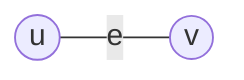
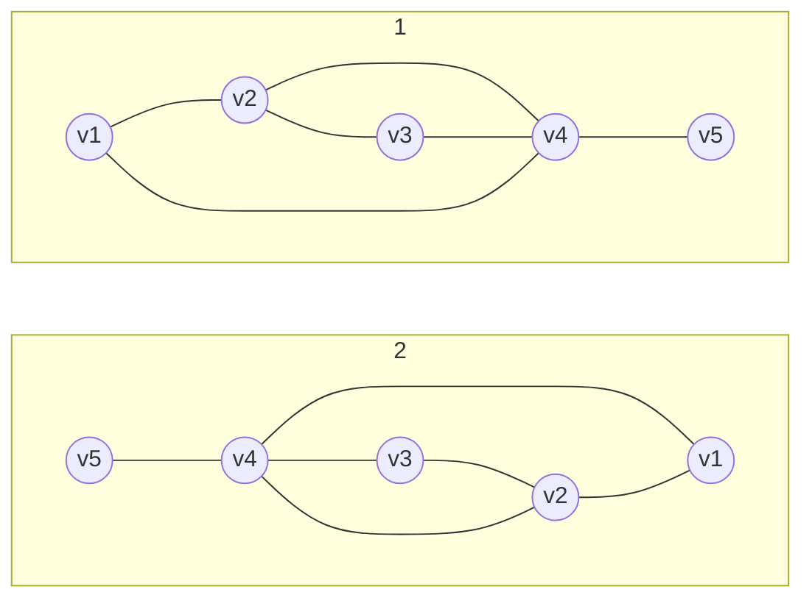
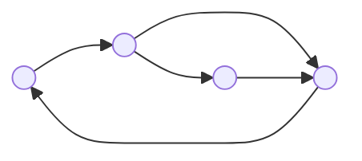

---
{"dg-publish":true,"permalink":"/leeds-university/computer-science/compulsory-modules/discrete-mathematics/3-graph-theory/3-2-graph-models/"}
---

###### Graph Models
A *[[Leeds University/Computer Science/Compulsory Modules/Discrete Mathematics/3. Graph Theory/Definitions/Simple Graph\|Simple Graph]]* $G=({\color{mauve} V}(G),{\color{orange} E}(G))$ with $p$ vertices and $q$ edges consists of a *vertex set* (or a *node set*) ${\color{mauve} V}(G)=\set{v_{1},\dots,v_{p}}$ and an *edge set* ${\color{orange} E}(G)=\set{{\color{yellow} e}_{1},\dots,{\color{yellow} e}_{q}}$ where each edge is an unordered pair of vertices

An edge ${\color{yellow} e}={u,v}$ is also denoted by $uv$ or $vu$

The vertices contained in an edge ${\color{yellow} e}$ are its *endpoints* (or *endnodes* or *endvertices*), and ${\color{yellow} e}$ is said to *connect* $u$ and $v$. An edge ${\color{yellow} e}=uv$ is said to be *incident* to its endpoints $u$ and $v$. Two vertices that are endpoints of the same edge are said to be *adjacent vertices*, and two edges that are incident to the same vertex are said to be *adjacent edges*. Two adjacent vertices are also called *neighbouring vertices*.

###### Example
$G=({\color{mauve} V}(G),{\color{orange} E}(G))$
${\color{mauve} V}(G)=\set{v_{1},v_{2},v_{3},v_{4},v_{5}}$
${\color{orange} E}(G)=\set{v_{1}v_{2},v_{2}v_{3},v_{3}v_{4},v_{1}v_{4},v_{2}v_{4}.v_{4}v_{5}}$

###### Types of Graphs

<a class="markdown-embed-link" href="/leeds-university/computer-science/compulsory-modules/discrete-mathematics/3-graph-theory/definitions/simple-graph/" aria-label="Open link"><svg xmlns="http://www.w3.org/2000/svg" width="24" height="24" viewBox="0 0 24 24" fill="none" stroke="currentColor" stroke-width="2" stroke-linecap="round" stroke-linejoin="round" class="svg-icon lucide-link"><path d="M10 13a5 5 0 0 0 7.54.54l3-3a5 5 0 0 0-7.07-7.07l-1.72 1.71"></path><path d="M14 11a5 5 0 0 0-7.54-.54l-3 3a5 5 0 0 0 7.07 7.07l1.71-1.71"></path></svg></a>

*Simple Graphs* are unweighted and undirected. They also contain **no** [[Leeds University/Computer Science/Compulsory Modules/Discrete Mathematics/3. Graph Theory/Definitions/Loop\|loops]] or [[Leeds University/Computer Science/Compulsory Modules/Discrete Mathematics/3. Graph Theory/Definitions/Parallel Edge\|parallel edges]]

<a class="markdown-embed-link" href="/leeds-university/computer-science/compulsory-modules/discrete-mathematics/3-graph-theory/definitions/multigraph/" aria-label="Open link"><svg xmlns="http://www.w3.org/2000/svg" width="24" height="24" viewBox="0 0 24 24" fill="none" stroke="currentColor" stroke-width="2" stroke-linecap="round" stroke-linejoin="round" class="svg-icon lucide-link"><path d="M10 13a5 5 0 0 0 7.54.54l3-3a5 5 0 0 0-7.07-7.07l-1.72 1.71"></path><path d="M14 11a5 5 0 0 0-7.54-.54l-3 3a5 5 0 0 0 7.07 7.07l1.71-1.71"></path></svg></a>

*Multigraphs* (or *graphs* or *undirected graphs*) allow [[Leeds University/Computer Science/Compulsory Modules/Discrete Mathematics/3. Graph Theory/Definitions/Loop\|loops]] and [[Leeds University/Computer Science/Compulsory Modules/Discrete Mathematics/3. Graph Theory/Definitions/Parallel Edge\|parallel edges]]

<a class="markdown-embed-link" href="/leeds-university/computer-science/compulsory-modules/discrete-mathematics/3-graph-theory/definitions/directed-graph/" aria-label="Open link"><svg xmlns="http://www.w3.org/2000/svg" width="24" height="24" viewBox="0 0 24 24" fill="none" stroke="currentColor" stroke-width="2" stroke-linecap="round" stroke-linejoin="round" class="svg-icon lucide-link"><path d="M10 13a5 5 0 0 0 7.54.54l3-3a5 5 0 0 0-7.07-7.07l-1.72 1.71"></path><path d="M14 11a5 5 0 0 0-7.54-.54l-3 3a5 5 0 0 0 7.07 7.07l1.71-1.71"></path></svg></a>

*Directed graphs* (or *digraphs*) ***ordered*** edges, which are called *directed edges* or *arcs*

<a class="markdown-embed-link" href="/leeds-university/computer-science/compulsory-modules/discrete-mathematics/3-graph-theory/definitions/weighted-graph/" aria-label="Open link"><svg xmlns="http://www.w3.org/2000/svg" width="24" height="24" viewBox="0 0 24 24" fill="none" stroke="currentColor" stroke-width="2" stroke-linecap="round" stroke-linejoin="round" class="svg-icon lucide-link"><path d="M10 13a5 5 0 0 0 7.54.54l3-3a5 5 0 0 0-7.07-7.07l-1.72 1.71"></path><path d="M14 11a5 5 0 0 0-7.54-.54l-3 3a5 5 0 0 0 7.07 7.07l1.71-1.71"></path></svg></a>

*Weighted Graphs*: Each edge ${\color{yellow} e}$ is assigned a weight $w({\color{yellow} e})$

You can also have different combinations of the above models, such as directed weighted graphs, or weighted simple graphs
