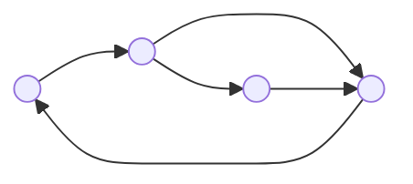

---
{"dg-publish":true,"permalink":"/leeds-university/computer-science/compulsory-modules/discrete-mathematics/3-graph-theory/definitions/directed-graph/","tags":["Definition"]}
---

*Directed graphs* (or *digraphs*) ***ordered*** edges, which are called *directed edges* or *arcs*

