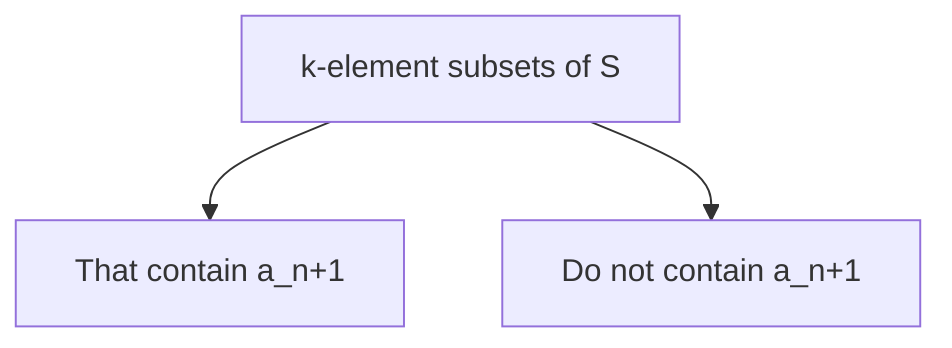

---
{"dg-publish":true,"permalink":"/leeds-university/computer-science/compulsory-modules/discrete-mathematics/combinatorics/definitions/a-combinatorial-proof/"}
---

A **Combinatorial Proof** of an identity is a proof that uses counting arguments to prove that both sides of the identity count the same objects but in different ways *or* a proof that is based on showing that there is a [[Leeds University/Computer Science/Compulsory Modules/Fundamental Math Concepts/5. Set Theory/Definitions/Definition 5.30 (Bijective)\|Bijection]] between the [[Leeds University/Computer Science/Compulsory Modules/Fundamental Math Concepts/5. Set Theory/5.1 Sets\|Sets]] of objects counted by the two sides of the identity

---
###### Example 1
**Prove that for a positive integer $\color{blue} n$,** $\color{blue} \sum^{n}_{k=0}(^{n}_{k})=2^{n}$
*Proof using Binomial Theorem*:
$(a+b)^{n}=$…
$a=b=1$
$2^{n}=(1+1)^{n}=\sum^{n}_{k=0}(^{n}_{k})1^{n-k}\times 1^{??}$

*Combinatorial Proof*:
$2^{n}$ = # of subsets of  set of $n$ elements
$X=\set{1,\dotsc,n}$ $|\mathcal{P}(X)|=2^{n}$

Count # of subsets of $X$
a subset of $X$ has $k$ elements $0\leq k\leq n$

---
###### Theorem 1.6 Pascal’s Identity
*Let $\color{blue} n$ and $\color{blue} k$ be positive integers with $\color{blue} n \geq k$. Then $\color{blue} (^{n+1}_{k})=(^{n}_{k-1})+(^{n}_{k})$*

$S = \set{a_{1},\dotsc a_{n+1}}$
\# of $k$-element subsets of $S = (^{n+1}_{k})$

Case 1 : # of subsets that contain $a_{n+1}$
\= # of subsets $S\backslash \set{a_{n+1}}$
$= (^{m}_{k-1})$

so by AP # of k-element subsets of S = $(^{n}_{k-1})+(^{n}_{k})$

---
###### Theorem 1.7 Vandermonde’s Identity
*Let $m$, $n$ and $r$ be non-negative integers with $r$ not exceeding $m$ or $n$. Then*
$(^{m+n}_{r})=\sum^{r}_{k=0}(^{m}_{r-k})(^{n}_{k})$

$S$ set with $m$ elements
$T$ set with $n$ elements

$|S\cup T|=m+n$
\# of $r$-element subsets of $S\cup T$
$=(^{m+n}_{r})$
*Consider an $r$-element subset of $S \cup T$*
*Call it $X$*
*$X$ has $k$ elements from $T$* $(^{n}_{k})$
*$X$ has $r-k$ elements from $S$ $(^{m}_{r-k})$
$0 \leq k \leq r$

$\set{k=0,k=1,\dotsc,k=r}$
by Multiply Principle $(^{n}_{k})(^{m}_{r-k})$
by Addition Principle total = $\sum^{r}_{k=0}(^{n}_{k})(^{m}_{r-k})$

---
###### 1.4 The Pigeonhole Principle
The *Pigeonhole Principle* (also known as the *Dirichlet Principle* ) is sometimes useful in answering the question: **is there an item having a given property?**

**Pigeonhole Principle**: If $n$ pigeons fly into $k$ pigeonholes and $k < n$, then some pigeonhole contains at least two pigeons

**Example**
Ten people have the first name Alice, Bernard and Charles, and last names Lee, McDuff and Ng. Show that at least two people have the same first and last names

**Pigeons** = The people = 10 = $n$
**Pigeonholes** = Full names = $3\times 3$ = $9$ = $k$
$n > k$

So by $\color{lightgreen} PHP$ $\exists$ two people with the same name

**Generalised Pigeonhole Principle**: If $n$ pigeons fly into $k$ pigeonholes, then some pigeonholes contains at least $\lceil\frac{n}{k}\rceil$ (Ceiling, i.e. rounded up) pigeons
*Proof by Contradiction*
$\neg(\textrm{Some pigeonhole contains} \geq \lceil\frac{n}{k}\rceil\textrm{ Pigeons})$
$=\textrm{Every pigeonhole contains}< \lceil\frac{n}{k}\rceil\textrm{ Pigeons}$
$\therefore$ # of pigeons $< \lceil\frac{n}{k}\rceil \times k$
$\leq(\frac{n}{k}+1)k$
$= \frac{n}{k}k+k=n+k$
---
$n$ = # of Pigeons $\leq (\lceil\frac{n}{k}\rceil-1)k$
$<(\frac{n}{k}-1+1)k$
#TODO finsih