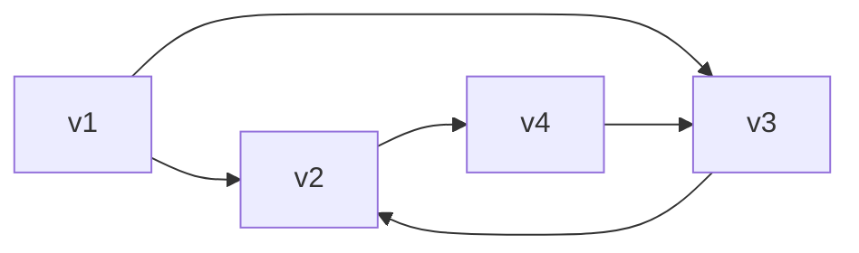

---
{"dg-publish":true,"permalink":"/leeds-university/computer-science/compulsory-modules/discrete-mathematics/graph-theory/definitions/directed-graph/","tags":["Definition"]}
---

*Digraphs* have edges with *ordered* pairs of vertices, and are called *directed edges* or *arcs*

