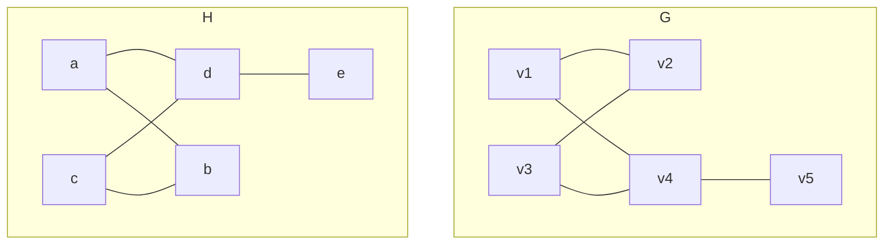

---
{"dg-publish":true,"permalink":"/leeds-university/computer-science/compulsory-modules/discrete-mathematics/graph-theory/definitions/isomorphic/","tags":["Definition"]}
---

Graphs $\color{lightgreen} H$ and $\color{lightgreen} G$ look exactly the same with the exception that their vertices and edges have different labels. $\color{lightgreen} H$ and $\color{lightgreen} G$ are **not** identical, but isomorphic.
