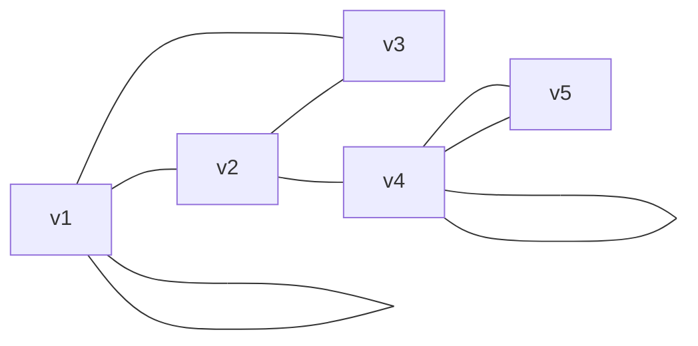

---
{"dg-publish":true,"permalink":"/leeds-university/computer-science/compulsory-modules/discrete-mathematics/graph-theory/definitions/undirected-graph/","tags":["Definition"]}
---

*Multigraphs* allow *loops* (vertex to itself) and *parallel edges* (multiple edges with same connections)

