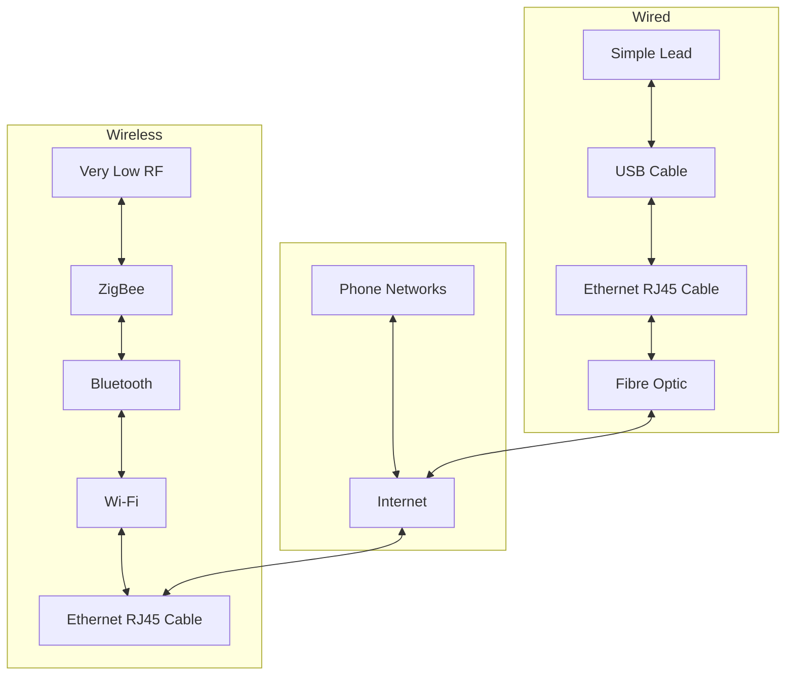

---
{"dg-publish":true,"permalink":"/leeds-university/computer-science/compulsory-modules/professional-computing/week-3-1-networks-and-software/week-3-1-networks-and-software/"}
---

#### Network Convergence

