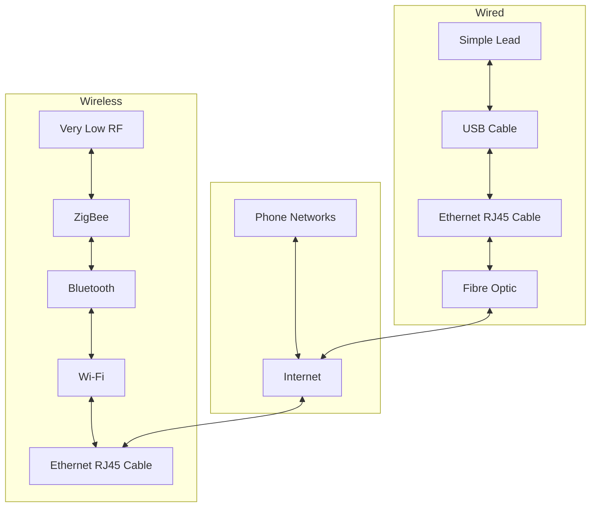

---
{"dg-publish":true,"permalink":"/leeds-university/computer-science/compulsory-modules/professional-computing/week-3-1-networks-and-software/week-3-1-networks-and-software/"}
---

#### Network Convergence

<a class="markdown-embed-link" href="/leeds-university/computer-science/compulsory-modules/professional-computing/week-3-1-networks-and-software/early-history-of-the-internet-and-web/" aria-label="Open link"><svg xmlns="http://www.w3.org/2000/svg" width="24" height="24" viewBox="0 0 24 24" fill="none" stroke="currentColor" stroke-width="2" stroke-linecap="round" stroke-linejoin="round" class="svg-icon lucide-link"><path d="M10 13a5 5 0 0 0 7.54.54l3-3a5 5 0 0 0-7.07-7.07l-1.72 1.71"></path><path d="M14 11a5 5 0 0 0-7.54-.54l-3 3a5 5 0 0 0 7.07 7.07l1.71-1.71"></path></svg></a>

uh, yeah!

<a class="markdown-embed-link" href="/leeds-university/computer-science/compulsory-modules/professional-computing/week-3-1-networks-and-software/early-networks/" aria-label="Open link"><svg xmlns="http://www.w3.org/2000/svg" width="24" height="24" viewBox="0 0 24 24" fill="none" stroke="currentColor" stroke-width="2" stroke-linecap="round" stroke-linejoin="round" class="svg-icon lucide-link"><path d="M10 13a5 5 0 0 0 7.54.54l3-3a5 5 0 0 0-7.07-7.07l-1.72 1.71"></path><path d="M14 11a5 5 0 0 0-7.54-.54l-3 3a5 5 0 0 0 7.07 7.07l1.71-1.71"></path></svg></a>

## Analogue

#### Napoleon's Network
> 11 o'clock, 2nd March, 1791:
> Claude Chappe used a mechanical device to send a coded signal read by his brother 10 miles away with a telescope

