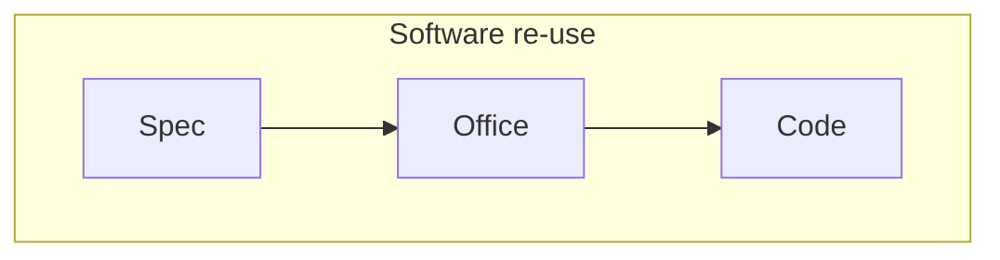

---
{"dg-publish":true,"permalink":"/leeds-university/computer-science/compulsory-modules/professional-computing/week-3-2-software-development-process/5-build/"}
---

>Building the actual software
#### Either
- Writing Unit Tests and Programming
##### Or (better)
- Software re-use

###### Spec
Analysis and Design Documents
###### Office
Uses Integrated Development Environment to massively improve ease of work
###### Code
Software
#### Results in
- Software Product
