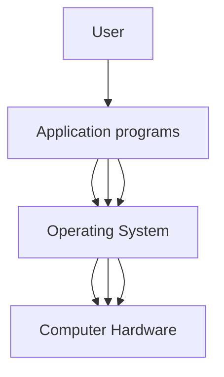

---
{"dg-publish":true,"permalink":"/leeds-university/computer-science/year-2/operating-systems/1-introduction-to-os/main-definitions/"}
---

A **computer system** can be divided into four components:
- Hardware
- Operating System
- Application Programs
- User
>[!info] 
> **OS is a resource allocator**
> Hardware (CPU, memory, mouse, keyboard, …) are resources. Multiple applications running on the system compete for them. The Operating System coordinates hardware use among users and applications

###### User view
- A Laptop or PC that consists of a human I/O (e.g. mouse/monitor)
- One user that wants to use all the resources
- OS designed for ***ease of use*** instead of ***resource allocation***
- Many users interact with mobile devices: touch screen, voice recognition
>[!tip] Embedded Systems
> Some computers have little or no user view: home appliances, various devices in cars, and other specialised computers that work on their own

###### System view
- Resource allocator,  involved with hardware intimately
- Manages CPU time, memory space, storage space, I/O access
- Faces several requests—has to decide who gets resources and who waits (users, applications)
- Responsible for overall efficient operation of the system
>[!tip]  **Control Program**
> Different view of OS. Manages the control of programs to prevent errors and improper use of the hardware

